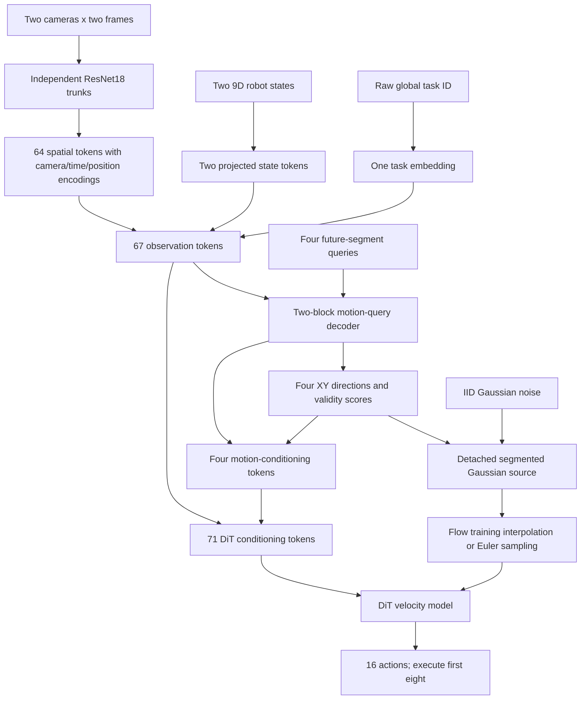

# Spatial motion-query DiT policy: implementation and experiment plan

Status: model, training integration, launcher, and reporter implemented; the authorized 500-epoch scratch run is in progress. Full benchmark results are pending. See [execution status](#20-implementation-and-execution-status) for the run and artifacts.

Prepared: 2026-09-13.

Repository: `fm_dno`.

## 1. Objective and first-run scope

Replace the standalone policy's pooled-feature heading MLP with a decoder that reads spatial image tokens and predicts a coarse future motion plan. Use that plan both to construct the flow source and to condition the DiT velocity model.

The first experiment trains the complete RGB/state policy from scratch on LIBERO-10. It uses the existing local StarVLA-style DiT flow backbone, XY motion prediction, four future segments, and one training seed. The proposed full-run budget is 500 completed epochs, with synchronous 500-episode evaluations after epochs 50, 100, ..., 500 and online W&B logging.

The 500-epoch budget is a concrete initial training schedule, not a claim that convergence has already been established. There is no pretrained VLM, pretrained visual backbone, or policy checkpoint in initialization. Six-axis motion prediction, alternative backbones, multiple seeds, and architecture ablations are later experiments.

### Fixed decisions

| Item | First implementation |
|---|---|
| Inputs | Agent-view RGB, wrist RGB, robot state, task ID |
| Observation history | Two frames |
| Image processing | 128 x 128 images; 116 x 116 crops |
| Visual backbone | Two independent ResNet18 trunks with GroupNorm, random initialization |
| Visual representation | Final convolutional feature maps before SpatialSoftmax or other pooling |
| Token width | 256 |
| Motion decoder | Two decoder blocks; four heads; four future queries |
| Motion outputs | Four XY unit directions and four validity probabilities |
| Action prediction / execution | Predict 16 seven-dimensional actions; execute the first eight |
| Flow backbone | Local `StarVLAFlowTransformer`, four alternating cross/self-attention blocks |
| Flow register tokens | 32 |
| Source | Segment-dependent Heading Gaussian in XY |
| Flow solver | Ten Euler steps; BF16 inference autocast on supported CUDA devices |
| Training | 500 epochs; seed 42; global batch 64; BF16; EMA |
| Evaluation | 50 fixed initial states per task, 500 episodes per evaluation |
| Evaluation cadence | Completed epochs 50, 100, ..., 500; `lazy_eval=false` |
| Logging | Online W&B; separate run ID and output directory |

## 2. Current implementation and required changes

The current [RGB encoder](../oat/perception/robomimic_vision_encoder.py) uses a ResNet18 convolutional trunk followed by SpatialSoftmax and a compact feature projection. The [fused encoder](../oat/perception/fused_obs_encoder.py) concatenates visual and state features into `[B, 2, D]`.

The [shared heading encoder](../oat/policy/flow_policy_shared_heading.py) flattens those two feature vectors and applies `Linear -> SiLU -> Linear` to produce one XY direction and one validity logit. That heading is repeated across observation frames, and the [Gaussian source](../oat/policy/flow_policy_heading_gaussian.py) uses it for the entire action chunk.

Three existing assumptions must change:

1. Observation frames and conditioning tokens currently have the same count. Spatial tokens and future-motion tokens require separate counts.
2. Heading currently summarizes the entire future chunk. The proposed decoder predicts four ordered segment summaries.
3. The dataset repeats endpoint actions when padding and returns no validity mask. Segment supervision needs an explicit mask so repeated padding does not become a motion label.

The implementation will also add a training-metrics hook: the current workspace logs the scalar policy loss but does not collect individual heading/source metrics from `loss_components`.

## 3. Model data flow



Observation encoding and motion decoding run once per training batch or inference observation window. During inference, their outputs are reused for all ten flow steps. The motion decoder receives observations and future-segment indices; it does not receive future actions, noisy actions, or flow integration time.

### Tensor contract

Here `B` is batch size, `T=2`, `H=16`, `K=4`, segment length `S=4`, action dimension `A=7`, and token width `D=256`.

| Tensor | Shape | Meaning |
|---|---|---|
| Each RGB observation | `[B, 2, 128, 128, 3]` | Channels-last input, same orientation as the existing dataset/runner |
| Each camera's cropped input | `[B*2, 3, 116, 116]` | Frames batched through one camera trunk |
| Each camera's final feature map | `[B*2, 512, 4, 4]` | Standard ResNet18 downsampling for this crop |
| Visual tokens | `[B, 64, 256]` | 2 cameras x 2 frames x 16 grid positions |
| Robot state | `[B, 2, 9]` | Position 3, quaternion 4, gripper joints 2 |
| State tokens | `[B, 2, 256]` | One token per observation frame |
| Task token | `[B, 1, 256]` | One categorical task embedding |
| Observation memory | `[B, 67, 256]` | Visual, state, and task tokens |
| Decoded future queries | `[B, 4, 256]` | One feature vector per future segment |
| Raw motion readout | `[B, 4, 3]` | Two direction coordinates and one validity logit |
| Unit directions | `[B, 4, 2]` | One normalized XY direction per segment |
| Validity logits/probabilities | `[B, 4]` | Motion validity, not epistemic uncertainty |
| Final DiT conditioning | `[B, 71, 256]` | 67 observation tokens plus four motion tokens |
| Actions, source, velocity | `[B, 16, 7]` | Complete action chunk |
| Future action mask | `[B, 16]`, boolean | Real action records versus repeated padding |

The encoder must compute and expose its token count from its configured geometry. Assert the expected 67/71 counts in this experiment; do not scatter these constants through policy code.

## 4. Spatial observation encoder

### 4.1 Visual trunks and preprocessing

Create a `SpatialTokenObservationEncoder` that implements the existing `BaseObservationEncoder` interface and returns observation tokens rather than one fused token per frame.

For each camera:

1. Normalize RGB with the inherited fixed `[0,255]` limits transform, producing the same numerical range as the existing policy. Do not add ImageNet normalization.
2. During training, sample a 116 x 116 crop for each example/camera and share its offset across the two history frames. This avoids introducing apparent temporal displacement through independently moving crops.
3. During validation and rollout, use a deterministic center crop with offset `(6,6)`.
4. Run a randomly initialized ResNet18 through its final convolutional stage. Instantiate without the classification head and without pretrained weights. Use GroupNorm in place of BatchNorm, matching the existing policy's normalization choice.
5. Flatten the 4 x 4 map into 16 spatial feature vectors. Apply a learned `Linear(512,256)` projection and LayerNorm.

Keep separate camera trunks and projections, matching the current default of independent camera models. Both frames of the same camera share weights. Reuse the resulting tokens between the motion decoder and DiT; do not run a second visual encoder for heading prediction.

### 4.2 Position and modality information

Each visual token receives:

- A learned camera embedding.
- A learned observation-time embedding distinguishing `t-1` and `t`.
- A fixed 2D sinusoidal spatial encoding.
- A learned visual-token type embedding.

Compute spatial encodings from nominal grid-cell centers mapped into the original image using the sampled crop offset. For grid column `u`, use `(crop_left + (u+0.5)*116/4)/128`, with the analogous expression for rows. These are image-position features; they do not imply calibrated 3D coordinates or geometric equivariance.

Token order is deterministic: camera, observation time, grid row, grid column. Preserve this ordering in checkpoint configuration and any attention visualizations.

### 4.3 State and task tokens

Concatenate `robot0_eef_pos`, `robot0_eef_quat`, and `robot0_gripper_qpos` into nine values per frame. Normalize each port using training-only statistics, project with `Linear(9,256)`, and apply LayerNorm plus state-type and observation-time embeddings.

Treat `task_uid` as categorical. The verified dataset uses global LIBERO IDs **30 through 39**, not local IDs 0 through 9. Persist the explicit lookup `[30,31,32,33,34,35,36,37,38,39]` and map it to ten embedding rows. Read IDs directly from raw observations, before numeric normalization. Verify that both history frames carry the same ID, and reject unknown IDs instead of silently clamping them.

The task token is separate from the nine-dimensional robot-state projection. Save the task-ID mapping in both the model configuration and checkpoint buffers so inference does not need the training dataset.

## 5. Motion-query decoder

Implement `MotionQueryDecoder` with four learned queries, width 256, four attention heads, two decoder blocks, a feed-forward width of 1024, and zero dropout for the first run.

Each query is assigned a fixed future interval:

| Query | Predicted action indices | Relative action times |
|---|---|---|
| 0 | `0:4` | `t` through `t+3` |
| 1 | `4:8` | `t+4` through `t+7` |
| 2 | `8:12` | `t+8` through `t+11` |
| 3 | `12:16` | `t+12` through `t+15` |

Initialize queries from learned vectors plus fixed segment-position encodings. A block uses pre-normalized residual operations:

```python
q = q + self_attention(layer_norm(q))
q = q + cross_attention(query=layer_norm(q), key=obs_tokens, value=obs_tokens)
q = q + feed_forward(layer_norm(q))  # Linear(256,1024), GELU, Linear(1024,256)
```

The four future queries can interact bidirectionally: they are predicted together from current observations, so a causal mask is unnecessary. Segment position is distinct from the flow solver's time variable.

A shared readout `Linear(256,3)` produces `(u_x,u_y,valid_logit)` for each segment. Compute direction normalization, logits, probabilities, and losses in float32 under autocast:

```python
u = raw_output[..., :2].float()
norm = u.norm(dim=-1, keepdim=True)
direction = u / norm.clamp_min(1e-6)
direction = torch.where(norm > 1e-6, direction, direction.new_tensor([1., 0.]))
valid_logit = raw_output[..., 2].float()
confidence = valid_logit.sigmoid()
```

Construct each motion-conditioning token as:

```python
geometry = torch.cat([direction, confidence[..., None]], dim=-1)
motion_tokens = layer_norm(q + geometry_projection(geometry) + motion_type_embedding)
cond = torch.cat([obs_tokens, motion_tokens], dim=1)
```

`geometry_projection` is `Linear(3,256)`. Cast its inputs to the module's working dtype as needed. This makes the explicit prediction available to the velocity model while retaining richer decoded features. Gradients through `direction`, `confidence`, and `q` remain connected on this conditioning route.

## 6. DiT conditioning integration

The existing [DiT implementation](../oat/model/flow/starvla_dit.py) checks conditioning against `[B,n_obs_steps,cond_dim]` and adds a learned observation-frame position tensor of that length. Passing 71 tokens while leaving that interface unchanged would fail.

Extend its constructor with two opt-in arguments:

```python
cond_len: Optional[int] = None
add_cond_pos_emb: bool = True
```

Implementation behavior:

- Effective conditioning length is `n_obs_steps` when `cond_len is None`; otherwise it is `cond_len`.
- Validate `cond` against `[B,effective_cond_len,cond_dim]`.
- Allocate/add `obs_pos_emb` only when `add_cond_pos_emb` is true. The default path preserves existing parameter names and shapes.
- For this new policy, set `cond_len=encoder.output_token_count()+4` and `add_cond_pos_emb=false`. The encoder and motion decoder already supply the relevant positions and types.
- Keep the policy's actual `n_obs_steps=2`. Never replace this value with 71; it also controls observation collection and dataset alignment.

Retain the current DiT action projection, flow-time embedding, action-position embeddings, 32 register tokens, four alternating cross/self-attention blocks, output normalization/modulation, and seven-channel velocity output.

Direct cross-attention to both observation and motion tokens lets the flow model correct imperfect coarse predictions. Motion predictions are guidance; they do not remove support for other action directions.

## 7. Dataset alignment and segment supervision

### 7.1 Verified dataset and split

Use `/home/haotian/code/oat/data/libero/libero10_N500.zarr` explicitly. The `fm_dno/data` symlink currently points to a missing `../shared_data` directory; a config path override avoids requiring a dataset copy or modifying another checkout.

Read-only inspection found:

| Property | Value |
|---|---|
| Demonstrations | 500, with 50 per task |
| Total frames | 138,090 |
| Actions | Seven channels |
| Task IDs | 30–39 |
| Existing seed-42 training/validation split | 450 / 50 demonstrations |
| Training/validation windows | 124,415 / 13,675 |
| Training raw per-coordinate XY RMS | Approximately `0.3212935751664734` |

The existing split is a random episode split across the suite, not a stratified 45/5 split within each task. Preserve it and save the actual episode indices in run metadata. Compute statistics from the dataset during setup; the numeric RMS above is a cross-check, not a hardcoded model constant.

### 7.2 Explicit action masks

Add `MotionPlanZarrDataset(HeadingZarrDataset)`. Inherit sampling, train/validation bookkeeping, and normalizer fitting. Extend `__getitem__` to return an `action_mask`.

With two observations and 16 actions, the current sampled sequence contains 17 entries. Observations are `sequence[:2]`, while target actions are `sequence[1:17]`. The current observation at `t` therefore aligns with the first predicted action.

Use the same sampler row as the returned example:

```python
item = super().__getitem__(idx)
_, _, sample_start, sample_end = self.seq_sampler.indices[idx]
slots = np.arange(self.n_action_steps) + max(self.n_obs_steps - 1, 0)
item['action_mask'] = torch.from_numpy(
    (slots >= sample_start) & (slots < sample_end)
)
return item
```

At the last real frame of an episode, the action mask is `[True,False,...,False]`, even though the inherited action array repeats the final action through the chunk.

Retain those repeated endpoint actions for the existing full-chunk flow objective and reconstruction metric. Apply the new mask to motion auxiliary supervision. This decision preserves the established action-generation training convention while preventing artificial future headings from padding.

The mask describes future episode boundaries. It must never enter the observation encoder, motion decoder, source construction, or inference conditioning.

### 7.3 Segment targets

Reshape raw XY actions to `[B,4,4,2]` and masks to `[B,4,4]`. For each example and segment:

```python
count = mask.sum(dim=-1)
resultant = (raw_xy * mask[..., None]).sum(dim=-2)
magnitude = resultant.norm(dim=-1)
has_data = count > 0
target_score = magnitude / (heading_xy_rms * count.clamp_min(1).float().sqrt())
target_valid = has_data & (target_score >= 0.05)
target_direction = resultant / magnitude[..., None].clamp_min(1e-6)
```

Use the actual real-action count for partially padded segments. Fully padded segments contribute to neither direction loss nor validity loss. A nonempty segment with little or cancelling net XY motion has an invalid direction and still supplies a validity label.

Fit `heading_xy_rms` from each raw training frame once using the existing `get_heading_xy_rms()` method. Do not estimate it from overlapping windows or padding. Register it as a persistent policy buffer and copy it into EMA through the existing model initialization path.

These labels summarize future translation commands. They are not robot yaw, measured physical displacement, or calibrated uncertainty estimates.

## 8. Segmented Gaussian source

The prior remains a full-support Gaussian for each action timestep, conditional on predicted segment direction. It does not generate one shared noise vector for an entire segment.

Sample `epsilon ~ N(0,I)` with shape `[B,16,7]` and set `z = prior_noise_scale * epsilon`. Detach directions and confidences for this route only. Repeat each of the four predictions across its four associated action slots.

Let the action normalizer be `normalized = raw * scale + offset`. For the two XY channels, use a scalar raw scale:

```text
q_raw = sqrt(mean(1 / scale_xy**2))
d_perp = (-d_y, d_x)

raw_xy = q_raw * (
    (prior_heading_mean * prior_noise_scale + prior_parallel_std * z_x) * d
    + prior_perpendicular_std * z_y * d_perp
)
source_xy = raw_xy * scale_xy + offset_xy
```

Default parameters are `prior_heading_mean=0.5`, `prior_parallel_std=1.0`, `prior_perpendicular_std=0.5`, and `prior_noise_scale=1.0`.

Use the transformed XY source when the predicted confidence is at least 0.5 and direction/confidence values are finite. For inactive segments, use the original normalized-space IID source `z` for those slots. Other action channels retain their entries from `z`.

Construct geometry in raw action coordinates before applying the potentially anisotropic affine normalizer. Both Gaussian standard deviations must stay strictly positive. Compute source geometry in float32 and cast the completed source to the working dtype afterward.

Source activation uses predictions at both training and inference. Ground-truth direction, target validity, and action masks never replace predictions in this path.

This design changes the mean and covariance across segments. It does not impose temporal covariance or hard-align the realized sum of sampled actions.

## 9. Objective and gradient flow

Use the current straight-path flow-matching objective:

```python
x1 = normalize_action(batch['action'])
x0 = segmented_source(noise, predicted_motion)  # helper detaches direction/confidence internally
t = torch.rand(B, device=x1.device)
xt = (1 - t[:, None, None]) * x0 + t[:, None, None] * x1
velocity = dit(xt, t * 1000, cond)
flow_loss = (velocity.float() - (x1 - x0).float()).square().mean()
```

Auxiliary losses are:

```python
cosine = (direction * target_direction).sum(-1).clamp(-1, 1)
direction_loss = (target_valid.float() * (1 - cosine)).mean()
validity_loss = (
    has_data.float()
    * binary_cross_entropy_with_logits(valid_logit, target_valid.float(), reduction='none')
).mean()
loss = flow_loss + 0.1 * direction_loss + 0.1 * validity_loss
```

Both auxiliary means are over all `[B,K]` slots, with masked entries contributing zero. This gives a fixed per-example objective that remains straightforward under gradient accumulation or DDP. It differs from the old direction loss divided by the number of valid headings: the effective directional contribution now reflects valid-segment prevalence. Log that prevalence and record this denominator choice in the run config.

For metrics, calculate angular error over valid segments only, using summed errors and valid counts. Calculate validity accuracy and label prevalence over nonempty segments only. Avoid reporting fully padded segments as stationary examples.

| Route | Gradient behavior |
|---|---|
| Auxiliary losses -> readout/queries/visual and state encoder | Connected |
| Flow loss -> DiT | Connected |
| Flow loss -> observation and motion conditioning | Connected |
| Flow loss -> heading through source construction | Detached |
| Normalizer and fitted RMS | Frozen |

## 10. Code architecture and ownership

### New modules

| Proposed file | Responsibility |
|---|---|
| `oat/perception/spatial_token_encoder.py` | Camera trunks, crop handling, spatial/time/type encodings, state/task tokens |
| `oat/model/heading/__init__.py` | Package for the new motion components |
| `oat/model/heading/motion_query_decoder.py` | Four-query attention decoder, direction/validity readout, motion tokens |
| `oat/model/heading/segmented_heading_prior.py` | Prediction decoding, segment targets, auxiliary reductions, Gaussian source math |
| `oat/dataset/motion_plan_zarr_dataset.py` | Existing heading dataset plus correctly aligned future action masks |
| `oat/policy/flow_policy_spatial_motion.py` | `SpatialMotionFlowPolicy`, integrating encoding, motion decoding, DiT, loss, inference |
| `oat/config/task/policy/libero/libero10_spatial_motion.yaml` | Same LIBERO-10 observation/data definition, with the checkpoint-based runner declared directly |
| `oat/config/train_flowpolicy_spatial_motion_dit.yaml` | Complete experiment configuration, including the correct runner |
| `scripts/run_spatial_motion_dit.sh` | Repository-relative launch wrapper and online logging environment |
| `scripts/report_spatial_motion_dit.py` | Summarize completed evaluations, per-task results, checkpoint selection, and artifact paths |

### Small changes to existing modules

| Existing file | Required change |
|---|---|
| `oat/model/flow/starvla_dit.py` | Optional conditioning-token count and externally supplied condition positions |
| `oat/workspace/train_policy.py` | Optional detached metric hook; completed-epoch validation/sample cadence; evaluation media logging and pending-evaluation recovery |
| `oat/env_runner/libero_official_runner.py` | Expose verified video artifact paths separately from JSON-serializable numerical metrics |

Keep the original `FlowPolicy`, shared-heading policies, and existing configs usable. The new class subclasses `FlowPolicy` for observation metadata, normalizer handling, time scaling, and standard policy interfaces. It overrides encoding/conditioning, loss, sampling, optimizer groups, and dummy-observation construction. Do not inherit the old `SharedHeadingObservationEncoder` or its hardcoded `D+3` condition layout.

### Public interfaces

```python
class SpatialTokenObservationEncoder(BaseObservationEncoder):
    def forward(self, obs_dict) -> Tensor: ...  # [B,L_obs,256]
    def output_feature_dim(self) -> int: ...    # 256
    def output_token_count(self) -> int: ...    # 67 for this config
    def modalities(self) -> list[str]: ...     # ['rgb','state']
    def set_normalizer(self, normalizer): ...

class MotionQueryDecoder(nn.Module):
    def forward(self, obs_tokens) -> dict:
        # direction [B,4,2], valid_logit/confidence [B,4], motion_tokens [B,4,256]
        ...

class SpatialMotionFlowPolicy(FlowPolicy):
    def encode_condition(self, obs_dict) -> tuple[Tensor, dict]: ...
    def configure_from_dataset(self, dataset): ...
    def loss_components(self, batch, noise=None, t=None) -> dict: ...
    def forward(self, batch) -> Tensor: ...     # scalar, compatible with workspace/DDP
    def predict_action(self, obs_dict) -> dict: ...
    def get_optimizer(self, policy_lr, obs_enc_lr, heading_lr, weight_decay, betas): ...
    def get_gradient_clip_groups(self) -> dict: ...
    def pop_training_metrics(self) -> dict: ... # detached numerator/count pairs
    def create_dummy_observation(self, batch_size=1, device=None) -> dict: ...
```

Compute `cond_len` from `obs_encoder.output_token_count() + num_motion_segments` before invoking the parent policy constructor; pass it through `backbone_kwargs`. Register `self.motion_decoder` only after the parent has initialized `nn.Module`. Reject inconsistent user-specified lengths and enforce `backbone_type="starvla_dit"` in this class. The motion decoder is a sibling of the observation encoder and DiT, so the inherited optimizer would omit it unless explicitly overridden.

Use optimizer groups for DiT, observation encoder, and motion decoder, all at `1e-4`. Apply `1e-6` weight decay to matrix weights and zero decay to biases, normalization parameters, and positional/query embeddings. Assert that every trainable parameter appears in exactly one group. Freeze all normalizer parameters. Use disjoint core and motion gradient-clip groups with maximum norm 1.0, following the existing heading-policy convention.

Dummy observations must contain valid raw task IDs and correctly typed RGB data; the generic random floating-point task-ID tensor is unsuitable for categorical lookup.

## 11. Training and inference execution

### Training batch

1. Read two observation frames, 16 actions, and an aligned action mask.
2. Encode observations once into spatial/state/task tokens.
3. Decode four motion queries; build explicit motion predictions and conditioning tokens.
4. Build target segment labels from raw training actions and masks.
5. Sample the source using detached predictions and IID noise.
6. Sample flow time, construct interpolation, and run DiT once.
7. Combine flow and auxiliary losses, backpropagate, clip, and update optimizer/EMA.
8. Cache detached metric numerator/count pairs from this same forward pass.

### Inference observation window

```python
cond, prediction = self.encode_condition(obs_dict)
noise = torch.randn(B, self.horizon, self.action_dim, device=cond.device)
x = self.make_source(noise, prediction)
for i in range(self.num_inference_steps):
    t = torch.full((B,), i / self.num_inference_steps, device=cond.device)
    x = x + self.model(x, self._scale_t(t), cond) / self.num_inference_steps
action_pred = self.normalizer['action'].unnormalize(x)
return {'action': action_pred[:, :8], 'action_pred': action_pred}
```

The implementation uses configured dimensions rather than literal 8/16 values. `predict_action` runs under inference mode through the standard evaluation path. Recompute the plan when the environment supplies the next observation window; there is no persistent plan state to clear between episodes.

### Checkpoint contents

Save the observation encoder, task mapping, motion decoder, DiT, all normalization state, fitted RMS, and complete model configuration. Training checkpoints also retain optimizer, scheduler, EMA, RNG, and progress state through the existing workspace.

The official evaluator instantiates `cfg.policy` generically and calls `predict_action`; it does not need a new policy allow-list entry. A fresh inference process must load the policy without opening the training Zarr dataset or downloading pretrained weights.

## 12. Concrete experiment configuration

Create a standalone config composed from `task/policy: libero/libero10_spatial_motion` and `_self_`, following the existing DiT recipe. The dedicated task config reproduces the original LIBERO-10 observation shapes, ports, dataset keys, and sampling settings, and directly declares `LiberoOfficialRunner`. It does not inherit the original task's generic runner mapping. This avoids a Hydra deep merge retaining keys such as `n_test`, `n_parallel_envs`, and `task_name`, which the new runner's constructor does not accept.

The following summarizes the experiment settings. The complete runnable configuration is [train_flowpolicy_spatial_motion_dit.yaml](../oat/config/train_flowpolicy_spatial_motion_dit.yaml).

```yaml
seed: 42
horizon: 16
n_action_steps: 8
n_obs_steps: 2

policy:
  _target_: oat.policy.flow_policy_spatial_motion.SpatialMotionFlowPolicy
  # shape_meta, obs_encoder and observation/action horizons are supplied here.
  backbone_type: starvla_dit
  embed_dim: 256
  n_layers: 4
  n_heads: 4
  dropout: 0.0
  backbone_kwargs:
    num_register_tokens: 32
    add_cond_pos_emb: false
    # cond_len is derived by the policy, expected to be 71.
  num_inference_steps: 10
  prior_noise_scale: 1.0
  num_motion_segments: 4
  motion_decoder_layers: 2
  motion_decoder_heads: 4
  motion_decoder_ff_dim: 1024
  heading_loss_weight: 0.1
  validity_loss_weight: 0.1
  min_target_confidence: 0.05
  min_source_confidence: 0.5
  prior_heading_mean: 0.5
  prior_parallel_std: 1.0
  prior_perpendicular_std: 0.5

training:
  resume: false
  num_epochs: 500
  num_demo: 500
  seed: 42
  allow_bf16: true
  use_ema: true
  max_grad_norm: 1.0
  gradient_accumulate_every: 1
  lr_scheduler: constant_with_warmup
  lr_warmup_steps: 500
  rollout_every: 50
  rollout_epoch_offset: 1
  val_every: 10
  sample_every: 50
  validation_epoch_offset: 1   # opt-in workspace option; default 0 for old configs
  sample_epoch_offset: 1       # opt-in workspace option; default 0 for old configs
  checkpoint_every: 1
  max_train_steps: null
  max_val_steps: null
  max_reconst_steps: null

optimizer:
  policy_lr: 1.0e-4
  obs_enc_lr: 1.0e-4
  heading_lr: 1.0e-4
  weight_decay: 1.0e-6
  betas: [0.9, 0.999]

dataloader:
  batch_size: 64
  shuffle: true
  num_workers: 4
  pin_memory: true
  persistent_workers: true
  drop_last: true

val_dataloader:
  batch_size: 64
  shuffle: false
  num_workers: 2
  pin_memory: true
  persistent_workers: true
  drop_last: false

task:
  policy:
    lazy_eval: false
    distributed_eval: false
    dataset:
      _target_: oat.dataset.motion_plan_zarr_dataset.MotionPlanZarrDataset
      zarr_path: /home/haotian/code/oat/data/libero/libero10_N500.zarr
      seed: 42
      val_ratio: 0.1
      # Retain original obs_keys, RGB keys, action key and horizons.
    env_runner:
      _target_: oat.env_runner.libero_official_runner.LiberoOfficialRunner
      suite: libero_10
      n_per_task: 50
      init_start: 0
      seed: 20260911
      workers: 8
      eval_gpu: 1             # physical GPU selected by the launch wrapper
      max_episode_steps: 550
      settle_steps: 10
      video_per_task: 1
      torch_threads: 1

logging:
  project: oat_dev
  group: libero10_spatial_motion_dit
  mode: online
  resume: false
  id: null                   # assign a unique ID at launch and persist it
  # Add a unique name, output directory and experiment tags.

metrics:                     # workspace settings, not W&B init arguments
  train_every_updates: 50
  log_eval_videos: true

checkpoint:
  topk:
    monitor_key: mean_success_rate
    mode: max
    k: 1
    format_str: "ep-{completed_epochs:04d}_success-{mean_success_rate:.4f}.ckpt"
  save_last_ckpt: true
  save_last_snapshot: false
  save_rollout_ckpt: true
  save_final_ckpt: true
  save_before_rollout: true  # opt-in pending-evaluation recovery
```

Copy the existing EMA settings explicitly: `update_after_step=0`, `inv_gamma=1.0`, `power=0.75`, `min_value=0.0`, `max_value=0.9999`. The new config must also include the full encoder settings, shape metadata, dataset keys, and Hydra output-directory settings; the block above intentionally illustrates the decisions rather than pretending to be a complete runnable file.

Use `rollout_epoch_offset=1` because the workspace internally numbers epochs from zero. Add the analogous opt-in offsets for validation and reconstruction so those measurements happen after completed epochs 10/20/... and 50/100/.../500. Preserve legacy defaults for other experiments.

`checkpoint_every=1` updates the recovery checkpoint each epoch. `save_rollout_ckpt=true` archives epochs 50/100/.../500, and top-k selection uses rollout success rate. Always retain and report the final epoch-500 checkpoint separately from the best observed checkpoint.

Explicitly shuffle training windows. Validation keeps deterministic dataset ordering. The existing task split remains fixed; shuffling changes sample order, not split membership or statistics.

## 13. Evaluation protocol

Use the existing checkpoint-based [LIBERO runner](../oat/env_runner/libero_official_runner.py), explicitly selected in the new config. Changing only `lazy_eval` would enable the original runner with different reset behavior.

At each scheduled evaluation:

1. Pause optimization and snapshot the selected EMA policy to an immutable inference checkpoint.
2. Evaluate all ten tasks, using official initial-state indices 0–49 for each task.
3. Use the same episode/policy seed derivation at every checkpoint, ten settling actions, fresh observations after settling, and a 550-policy-action limit.
4. Keep image orientation, crop behavior, task IDs, observation history, and execution horizon consistent with training.
5. Save 500 episode records, overall/per-task success counts, protocol metadata, checkpoint hashes, and one video per task.
6. Return verified scalar metrics to the training process, log them online, and continue training.

This is the repository's existing ten-settling-action comparison protocol. Record it explicitly rather than conflating it with other LIBERO evaluation recipes.

The complete run performs 5,000 scheduled benchmark episodes. An incomplete or error-containing evaluation is not a completed success-rate result. Preserve its artifacts, fix the evaluation failure, and continue from the same checkpoint as appropriate.

### Recovery at an evaluation boundary

The current workspace writes its regular training checkpoint after evaluation. Add an opt-in `save_before_rollout` path for this run so a simulator failure does not force repeating a completed training epoch and conflict with its immutable evaluation snapshot.

Before launching a scheduled evaluation, set a `pending_rollout` record containing the evaluated epoch and global step, capture optimizer/scheduler/EMA/RNG/progress state, and save a synchronous recovery checkpoint that includes the marker. A resumed run with this record must finish or reuse that same snapshot's evaluation before entering the next training epoch. After verified results have been logged and checkpoint selection updated, clear the marker and save the completed boundary. Add the marker to the workspace's serialized progress fields, with an absent/default value for older checkpoints.

This recovery retains the exact model snapshot used for evaluation. The current checkpoint system does not serialize persistent DataLoader worker state, so recovery is not a claim of bit-identical future augmentation or batch order.

## 14. Online W&B and training metrics

Set both the resolved config's `logging.mode=online` and the launch environment's `WANDB_MODE=online`. Existing shell wrappers default to offline and contain paths from another host, so use the new repository-relative wrapper. Use existing W&B authentication and record the actual run URL when initialization succeeds; do not silently substitute offline logging.

The workspace should consume detached metric data from the forward pass that already produced the optimized loss. Do not call `loss_components` a second time, which would rerun the encoder and draw different noise/time samples.

Add an optional `pop_training_metrics()` hook returning scalar numerator/count pairs. Accumulate those tensors and flush at a common interval of 50 optimizer updates and at epoch end. If distributed training is later enabled, sum numerators/counts across ranks before dividing. Only the main process writes W&B records.

Keep these new controls under a separate `metrics` config node. The current workspace passes all `logging` fields except `project` directly to W&B initialization, so adding custom metric-control keys there would create unsupported init arguments. Detach and clear metric caches promptly; they must not retain autograd graphs or enter checkpoint tensors.

Define training curves against optimizer/global step and evaluation curves against `completed_epochs` or `eval/completed_epochs`. The existing online setup binds some validation curves to `action_mse/completed_epochs`; use that axis only when the separate action-MSE evaluator is enabled. This run should log its ordinary validation and reconstruction curves against completed epochs instead.

Log:

- Total loss, flow loss, direction loss, and validity loss.
- Valid-segment angular error, overall and by future segment.
- Nonempty/valid target fractions, validity accuracy, and predicted confidence.
- Source-active fraction, overall and by segment.
- Learning rate per optimizer group, optimizer updates, completed epochs, throughput, and epoch duration.
- Validation loss every ten completed epochs and generated-action reconstruction MSE every 50.
- `mean_success_rate`, per-task success rate, episode count, and evaluation duration at epochs 50/100/.../500.

The official runner currently returns numerical metrics and saves videos on disk. Expose verified video paths through a separate media-artifact accessor, including the cached-evaluation path. The workspace can create W&B video values after evaluation. Keep those objects out of the runner's JSON metric verification and persistence.

Persist the resolved config, dataset split indices, task mapping, source parameters, normalization metadata, code revision/diff, selected hardware, checkpoint paths, and W&B run ID with the run.

## 15. Launch and compute plan

The launched run uses RTX 4090 GPU 0 for training and GPU 1 for synchronous checkpoint evaluation. Global batch 64 therefore means one DataLoader batch of 64. With the verified dataset and `drop_last=true`, this is 1,943 optimizer updates per epoch, or 971,500 updates across 500 complete epochs, provided the dataset and loader settings remain unchanged.

The evaluator's eight workers load their policies on GPU 1 while training is paused on GPU 0. The short eight-worker execution check completed all ten tasks with no simulator or video errors. The code also releases unused training CUDA cache before scheduled evaluation.

Both GPUs were free at launch. The existing dataset and LIBERO assets were reused with `/home/haotian/miniforge3/envs/oat/bin/python`; no pretrained weights or policy checkpoint were loaded.

The launcher should:

1. Resolve the repository from its own script location.
2. Select an explicit physical GPU and interpreter, and set `CUDA_VISIBLE_DEVICES`, `MUJOCO_GL=egl`, `PYOPENGL_PLATFORM=egl`, and consistent EGL device settings.
3. Set the official runner's `eval_gpu` to the selected physical GPU. Its subprocess remaps that device to logical `cuda:0`.
4. Set thread counts and `WANDB_MODE=online`.
5. Create a fresh run directory and unique W&B run ID; start with both training and logging resume disabled.
6. Run the training command under the available process manager, with console output captured in the run directory.

Launch a new run from the repository root using the wrapper:

```bash
bash scripts/run_spatial_motion_dit.sh --run-dir output/spatial_motion_dit/NEW_RUN_DIRECTORY
```

The wrapper defaults to training GPU 0, evaluation GPU 1, and the verified `oat` Python environment. It captures the resolved configuration, code, environment versions, and hardware. For interruption recovery, use `bash scripts/run_spatial_motion_dit.sh --resume output/spatial_motion_dit/EXISTING_RUN_DIRECTORY`; this reuses the saved configuration and W&B ID. Resume only after confirming that the existing trainer has stopped.

If two-GPU training is selected later, preserve global batch size and audit Accelerate's loader sharding and scheduler accounting before launch. It is not required for the first implementation. The first full training epoch took approximately 106 seconds, suggesting roughly 15 hours for training alone. The epoch-50 benchmark took 495.27 seconds (8.25 minutes); the ten scheduled evaluations add time, with duration depending on episode length.

## 16. Implementation sequence

| Step | Work | Completion condition |
|---|---|---|
| 1 | Add the spatial encoder and persistent task mapping | Produces correctly positioned `[B,67,256]` tokens from real observations |
| 2 | Add the two-block motion decoder | Produces finite directions, validity scores, and four motion tokens |
| 3 | Add sampler-derived masks and segment targets | Correct first/last-frame alignment and partial/empty-segment handling |
| 4 | Add segmented Gaussian math and `SpatialMotionFlowPolicy` | One joint forward/backward and observation-only inference work |
| 5 | Extend the DiT condition interface and optimizer groups | 71-token conditioning works; all trainable parameters are optimized once |
| 6 | Add config, metric hooks, epoch offsets, and launcher | Resolved config reflects the complete agreed experiment |
| 7 | Exercise the checkpoint/evaluation path briefly | A reloaded policy runs in the actual LIBERO evaluator |
| 8 | Launch and complete training | 500 completed epochs and ten complete 500-episode evaluations |
| 9 | Generate the result report | W&B URL, final/best checkpoints, curves, per-task scores, videos, and exact protocol |

Encoder/decoder work and dataset/source work can be implemented in parallel with separate file ownership. Integrate the policy and training hooks after those interfaces are established.

## 17. Minimal verification before the full run

Keep verification focused on failures that could waste a long training run:

- Inspect the resolved Hydra config for scratch initialization, dataset path, DiT-only selection, online logging, and completed-epoch evaluation cadence.
- Use one real minibatch to check tensor shapes, finite losses, gradients through both conditioning and auxiliary supervision, and complete optimizer coverage.
- Include first-frame, partial-tail, and last-frame examples in that same check; confirm padding masks and absence of future labels from inference/source inputs.
- With fixed noise, check the inactive-source fallback and segment-to-action indexing; verify that model/normalizer state survives checkpoint reload.
- Run a short rollout through the actual checkpoint-based evaluator before epoch 50, with the planned worker concurrency and resident training state. Keep this labeled as an execution check rather than a benchmark result.
- Confirm that the W&B run is online and visible, then proceed directly to the full training run.

These are a small set of targeted execution checks. The first experiment does not require a broad unit-test suite, miniature learning-curve experiments, an architecture sweep, or multiple training seeds before producing the requested result.

## 18. Deliverables and interpretation

The implementation is complete when the new policy/config can train from scratch and load for inference, and the full run has produced:

- Overall and per-task LIBERO-10 success rates at completed epochs 50, 100, ..., 500.
- A final epoch-500 checkpoint and the best observed success-rate checkpoint.
- Online W&B curves and the run URL.
- Per-episode records, evaluation metadata, checkpoint hashes, and ten videos per evaluation.
- A Markdown report stating the training budget, initialization, data split, protocol, wall-clock duration, and artifact locations.

The first run establishes the new design's performance. It does not by itself isolate gains from spatial features, attention decoding, or segmented targets; those factors change together. A later matched comparison can separate them by using the same targets with an MLP decoder and by varying the number of segments.

## 19. Existing code references

- [Current Gaussian DiT recipe](../oat/config/train_flowpolicy_headinggaussian_starvlaDiT.yaml)
- [LIBERO-10 task and data defaults](../oat/config/task/policy/libero/libero10.yaml)
- [Base flow policy and optimizer](../oat/policy/flow_policy.py)
- [Current shared heading encoder and supervision](../oat/policy/flow_policy_shared_heading.py)
- [Current Heading Gaussian source](../oat/policy/flow_policy_heading_gaussian.py)
- [DiT backbone](../oat/model/flow/starvla_dit.py)
- [Training workspace and evaluation scheduling](../oat/workspace/train_policy.py)
- [Heading dataset and training-only RMS](../oat/dataset/heading_zarr_dataset.py)
- [Training-only normalization and split bookkeeping](../oat/dataset/train_split_zarr_dataset.py)
- [Sequence sampling and endpoint padding](../oat/common/seq_sampler.py)
- [Checkpoint-based LIBERO evaluation](../oat/env_runner/libero_official_runner.py)


## 20. Implementation and execution status

Implementation steps 1–7 are complete. The full training/evaluation run and final result verification remain in progress.

The implemented model has 29,226,634 trainable parameters. A real batch of 64 passed the forward/backward, finite-gradient, optimizer-coverage, and strict checkpoint-reload checks; peak allocated GPU memory in that check was approximately 2.22 GB. A short checkpoint-based simulator execution check completed one episode for each of ten tasks with eight workers and no simulator or video errors. Its untrained, eight-action episodes are execution checks and do not count toward benchmark results.

The first scheduled benchmark, after 50 full epochs and 97,150 optimizer updates, achieved **87.8% success (439/500)**. Independent verification confirmed 500 unique episodes, 50 initial states per task, zero simulator/video errors, and all ten selected videos. W&B received the score and all ten videos. Its archived epoch-50 training checkpoint remains available.

The second scheduled benchmark, after 100 full epochs and 194,300 optimizer updates, achieved **88.0% success (440/500)**: one additional successful episode (+0.2 percentage points) compared with epoch 50. Independent verification again confirmed full task/initial-state coverage, zero simulator/video errors, ten videos, and matching checkpoint hashes. All 329 evaluated EMA tensors exactly match the frozen training boundary. The evaluation took 492.97 seconds. Remote W&B history matches the epoch-100 metrics, and all ten uploaded video hashes match the epoch-100 files. The reporter verified its training checkpoint against the evaluated EMA weights; the epoch-100 archive remains available. Validation loss at epoch 100 is 0.2241, continuing its upward trend; this does not change the authorized 500-epoch schedule. Training resumed after evaluation.

The third scheduled benchmark, after 150 full epochs and 291,450 optimizer updates, achieved **88.2% success (441/500)**. This is one additional success (+0.2 percentage points) compared with epoch 100, and two (+0.4 points) compared with epoch 50. Independent verification confirmed all 500 unique episodes, 50 initial states per task, zero simulator/video errors, ten videos, and actual checkpoint hashes. The evaluation took 490.28 seconds. All 329 EMA tensors match the immutable evaluated snapshot; the reporter verified the current best resumable checkpoint at `checkpoints/ep-0150_success-0.8820.ckpt`. W&B received matching epoch-150 metrics and all ten videos, verified by file hashes. Validation loss is 0.2532 and reconstruction MSE is 0.04668. The original trainer resumed beyond the evaluation boundary.

Seven scheduled evaluations and full 500-epoch completion remain pending. Detailed evidence is in `epoch_0050_boundary_audit.json`, `epoch_0050_independent_verification.json`, `epoch_0100_boundary_audit.json`, `epoch_0100_independent_verification.json`, `epoch_0150_boundary_audit.json`, `epoch_0150_independent_verification.json`, and the generated result report in the run directory. `completion_requirements_audit.json` separates implementation evidence from the remaining full-run requirements; final remote W&B delivery must also be verified.

The live scratch run started on 2026-09-13 at 20:08 UTC:

| Artifact | Location |
|---|---|
| Online W&B | [libero10_spatial_motion_dit_500ep_b92fb30fdc15](https://wandb.ai/andyliu7081-northeastern-university/oat_dev/runs/b92fb30fdc15) |
| Run directory | `output/spatial_motion_dit/20260913_500ep_seed42` |
| Generated progress/result report | [RESULTS.md](../output/spatial_motion_dit/20260913_500ep_seed42/RESULTS.md) |
| Exact launch/configuration | `launcher.json` and `resolved_config.yaml` in the run directory |
| Exact data split and fitted statistics | `training_dataset.json` in the run directory |
| Console and metric records | `console.log` and `logs.json` in the run directory |
| Persistent process session | tmux `fm_spatial_motion_500_20260913` |
| Completion watcher | tmux `fm_spatial_motion_report_20260913`; `completion_watcher_status.json` and `completion_watcher.console.log` in the run directory |
| Preflight evidence | `output/spatial_motion_dit_preflight/verification.json` |

Update the report while training is active with:

```bash
PYTHONPATH="$PWD" /home/haotian/miniforge3/envs/oat/bin/python scripts/report_spatial_motion_dit.py --run-dir output/spatial_motion_dit/20260913_500ep_seed42 --plot
```

The reporter marks partial runs incomplete. After training exits successfully, rerun it with `--require-complete`. Completion requires verified 500-episode evaluations at all ten scheduled epochs, the final epoch-500 checkpoint paired with its evaluated EMA weights, and the full 971,500-update training budget. The reporter also verifies the best resumable checkpoint against its evaluated EMA snapshot and records total wall-clock time from launch to successful exit. The run-local watcher invokes reporting after verified evaluations and invokes `--require-complete` after trainer exit; its process-identity checks never restart training. Inspect the launcher's exit record as well as the report before treating the experiment as finished.
